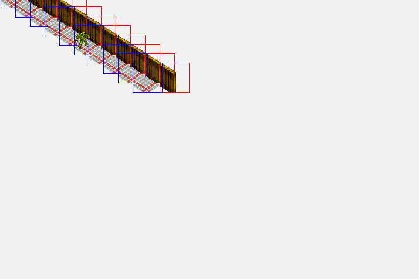
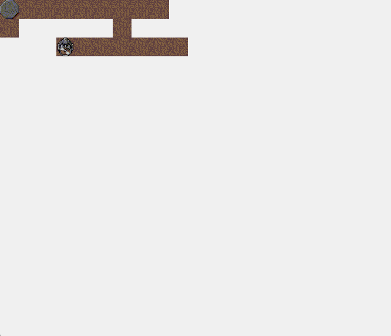
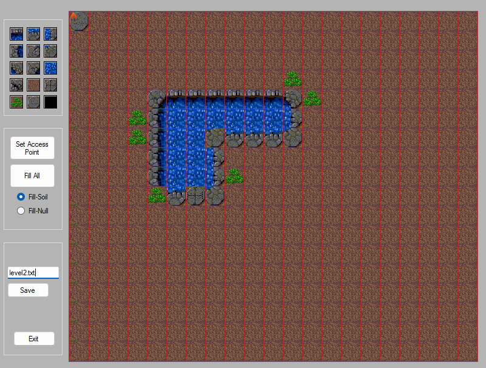
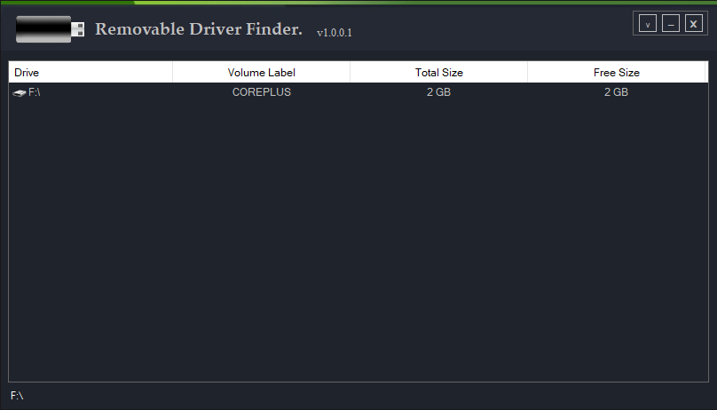
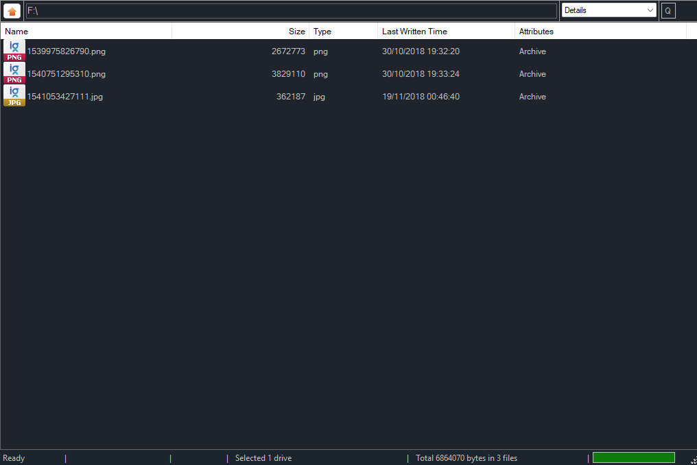
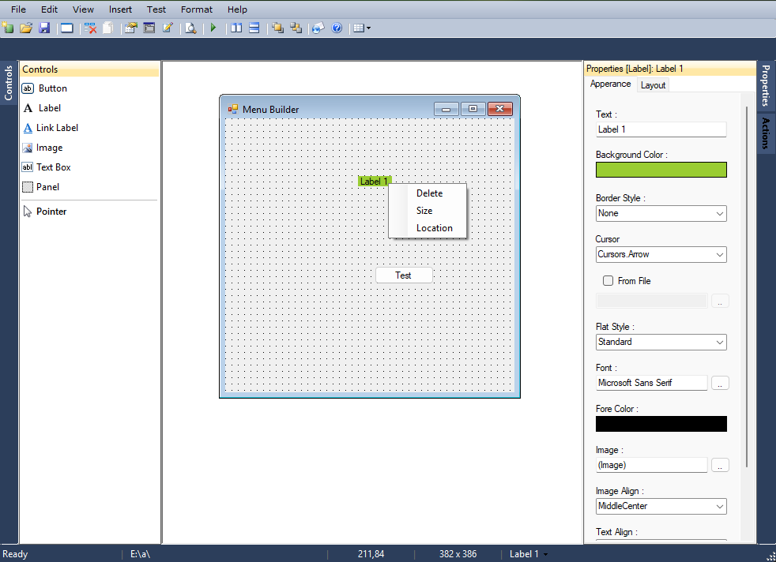
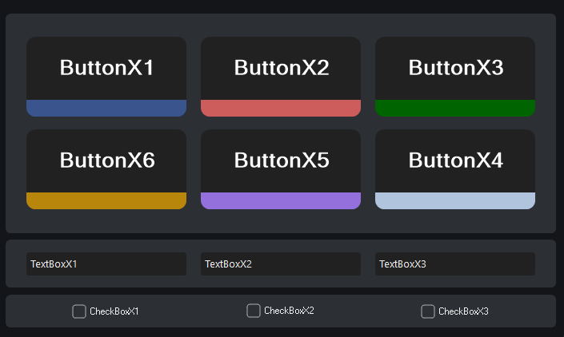

# vbnet-archive

An archive of unfinished Visual Basic projects I made in 2014-2017 while learning to program

The commits are backdated using the file modification dates preserved in the original .rar archive

A few projects I was working on

### [Game](20151231.bak/Games/Game)
A 2D game (incomplete)
 

 
### [Game_New](20151231.bak/Games/Game_New)
A 1D game (incomplete)
 

 
### [MapEditor](20151231.bak/Games/MapEditor)
A map editor for Game_New
 

 
### [Driver](20151231.bak/My/Driver)
A removable drive explorer
 

 
### [FileManager](20151231.bak/My/FileManager)
A file manager similar to Windows Explorer
 

 
### [Menu_Builder](20151231.bak/My/Menu_Builder)
A drag-and-drop builder for Windows Forms apps (incomplete)
 

 
### [ThemeX](20170630.bak/Custom%20Controls/ThemeX)
A custom theme for Windows Forms controls
 

